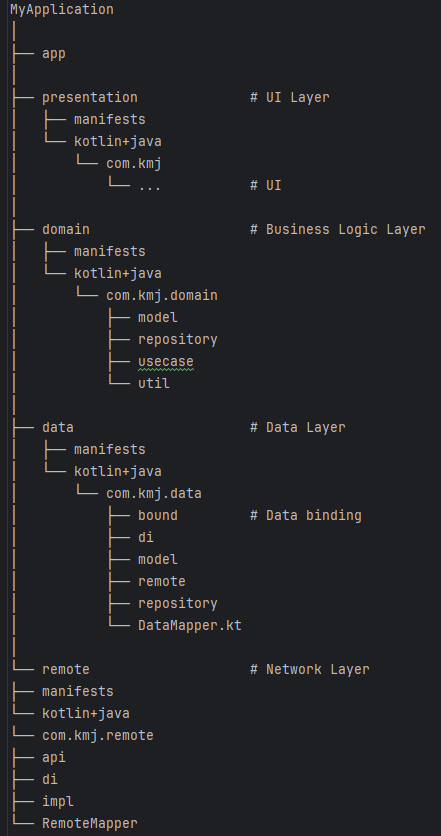

# MapleDictionary
이 코드는 Jetpack Compose UI + Clean Architecture + MVVM + Hilt 사용을 위한 연습 진행중인 앱 입니다.
  

## Clean Architecture Module

app → presentation → domain ← data ← remote

 

  

## TODO

- Monster Map 연동
- NPC API 연동
- NPC MAP 연동
- API 속도 개선